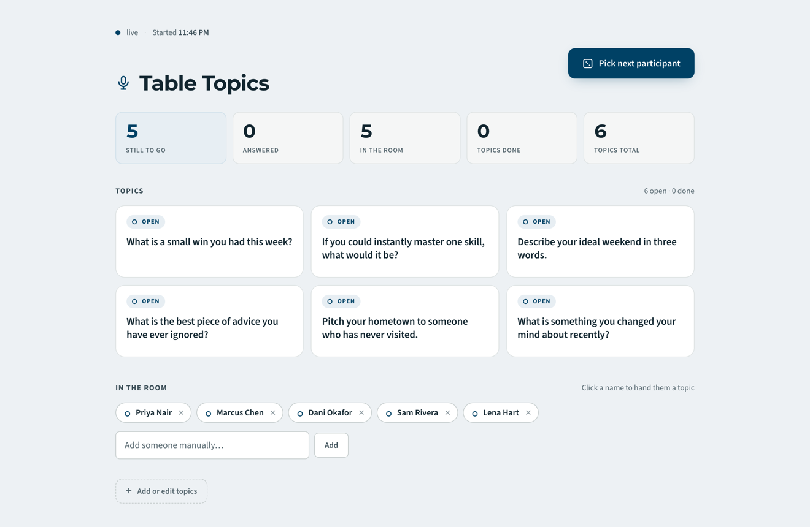
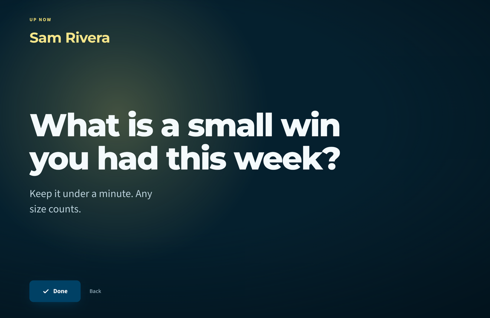

# Table Topics

Run **Table Topics** in a video meeting from one local command. The board reads
your Zoom Participants panel automatically, rolls a random person who has not
gone yet, and lets you hand them a prompt. The prompt then fills the screen for
the whole room. Screen-share the browser tab and everyone sees who is up and
what they have been asked.

One process, one command. No Node, no Zoom account, no credentials, nothing
saved on a server.

<p align="center">
  <video src="https://github.com/user-attachments/assets/ff7c856f-1bef-4aea-9868-7e4fb2b1ce40" poster="https://raw.githubusercontent.com/rlorenzo/zoom-table-topics-board/main/docs/reveal.png" controls muted playsinline width="860"></video>
</p>
<p align="center"><em>Load the sample meeting, roll a name under the spotlight,
hand them a prompt, and put it up for the room.</em></p>

<table>
  <tr>
    <td width="50%" valign="top">
      <br>
      <em>The host's control board: a calm, light surface to queue people and prompts.</em>
    </td>
    <td width="50%" valign="top">
      <br>
      <em>The chosen prompt fills the screen for the whole room to read.</em>
    </td>
  </tr>
</table>

## Quick start

```bash
uv sync
uv run board.py
```

Open <http://localhost:3000> and screen-share that browser tab. That is the
whole setup.

- On **macOS** (with Accessibility granted) or **Windows** (with the bundled
  UIA backend), the board reads Zoom's Participants panel every few seconds and
  fills the roster for you.
- **Anywhere else**, or without permission, it runs in manual mode: type names
  in yourself. The board looks and works the same either way.

## How it works

1. **Build your topics.** Add a prompt (a headline plus optional details), one at
   a time or pasted in as a block. Topics are saved in your browser, so a reload
   or your next meeting pre-fills them. Nothing is stored on a server, and
   nothing is shared automatically.
2. **Pick someone.** Hit *Pick next participant*. The board rolls a random person
   who has not answered yet (the host is skipped by default, since you are
   running it). Do not like the draw? Pick again.
3. **Hand them a topic.** Click an open topic, or hit *Surprise me* for a
   Press-Your-Luck spin that lands on a random one. The topic locks to that
   person and the screen goes full-screen with their name, the prompt, and any
   details, sized to read from across the room.
4. **Mark it done.** When they finish, hit *Done*. The topic grays out with their
   name, and you are back on the board to pick the next person.

State lives for the meeting only. *New round* clears assignments and starts a
fresh round with the same topics and roster.

## Auto-reading Zoom on macOS

Auto-read uses pyobjc and the macOS Accessibility permission. Both are installed
by `uv sync`. Then:

1. Grant Accessibility permission to the app you run this **from** (Terminal or
   iTerm), in **System Settings > Privacy & Security > Accessibility**.
2. Reopen that terminal so the new permission takes effect.
3. Start your meeting, open the Participants panel, then run `uv run board.py`.

Zoom's accessibility tree is undocumented and shifts between versions, so if names
do not appear, tune the matcher:

```bash
uv run board.py --anchor-regex 'participants|attendees' --debug
```

Known limits: virtualized participant lists may only expose the names currently
scrolled into view, and dial-in callers sometimes show up as phone numbers.

## Auto-reading Zoom on Windows

Windows auto-read uses UI Automation via the `uiautomation` package, which
`uv sync` installs for you. No extra permission prompt is needed.

## Manual mode (no setup)

Want to skip Zoom reading entirely, or running somewhere without the
accessibility backend? Add people by hand and pass `--no-ax`:

```bash
uv run board.py --no-ax
```

## CLI flags

| Flag | Default | Meaning |
| --- | --- | --- |
| `--port` | `3000` | Port for the local web UI |
| `--interval` | `5.0` | Seconds between Zoom panel reads |
| `--no-ax` | off | Manual entry only; never read Zoom |
| `--anchor-regex` | `participant` | Regex that locates the participants subtree |
| `--exclude` | (none) | Extra comma-separated terms to drop from names |
| `--min-len` | `2` | Minimum length for a string to count as a name |
| `--debug` | off | Print reader diagnostics to stderr |

## Design

The board is styled to match the **Toastmasters International** brand (Loyal
Blue, Happy Yellow, Montserrat and Source Sans 3), so it feels at home in a club
meeting. It is not an official Toastmasters product and does not use the
Toastmasters logo. The visual system is documented in
[`DESIGN.md`](DESIGN.md); the product direction lives in [`PRODUCT.md`](PRODUCT.md).

## Development

```bash
uv sync --dev
uv run pytest          # tests
uv run ruff check .    # lint
uv run mypy            # type-check (strict)
uv run pre-commit run --all-files
```

Front-end checks and the demo recorder use Node:

```bash
npm install
npm test                          # vitest unit tests
npm run check                     # lint + html-validate + coverage + dead code
npm run record:demo               # rewrites docs/demo.webm from a scripted run
```

The recorder also needs Chromium and ffmpeg available once:

```bash
npx playwright install chromium   # records the flow
brew install ffmpeg               # transcodes the capture to VP9 (or apt/choco)
```

## Credits

The Zoom-reading engine (accessibility scraping, name cleaning, host detection,
and the HTTP plus Server-Sent-Events server pattern) is shared in spirit with its
sibling project, the [Zoom Icebreaker tracker](https://github.com/rlorenzo/zoom-icebreaker).
